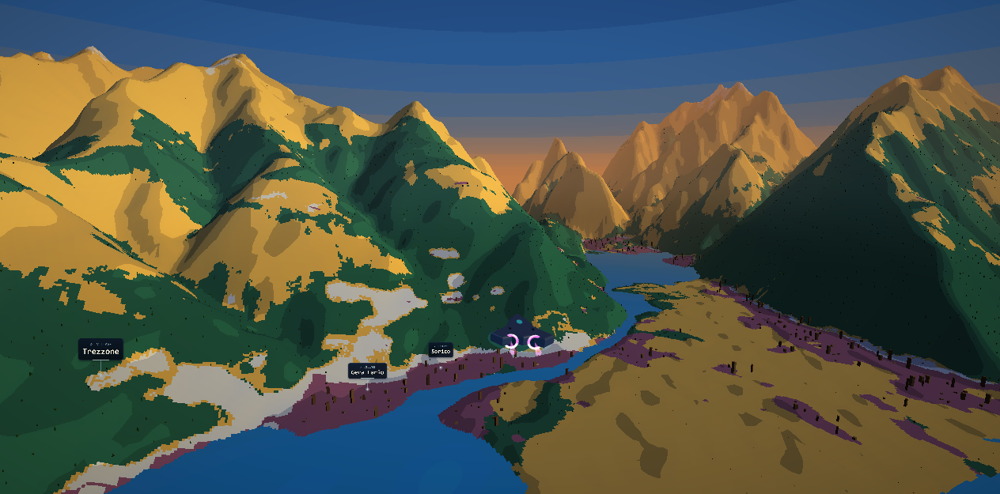
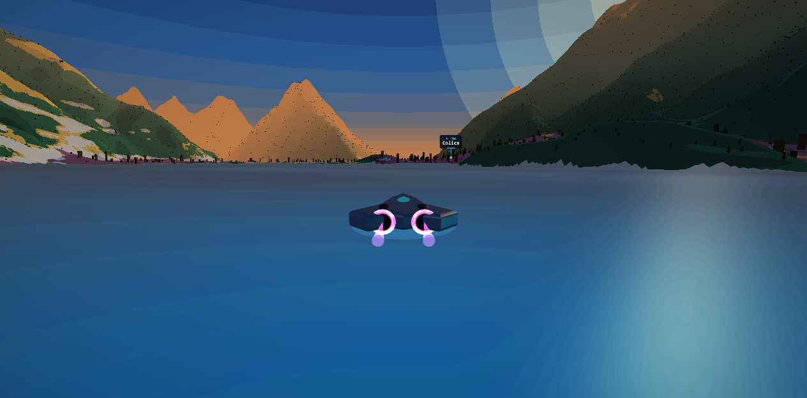
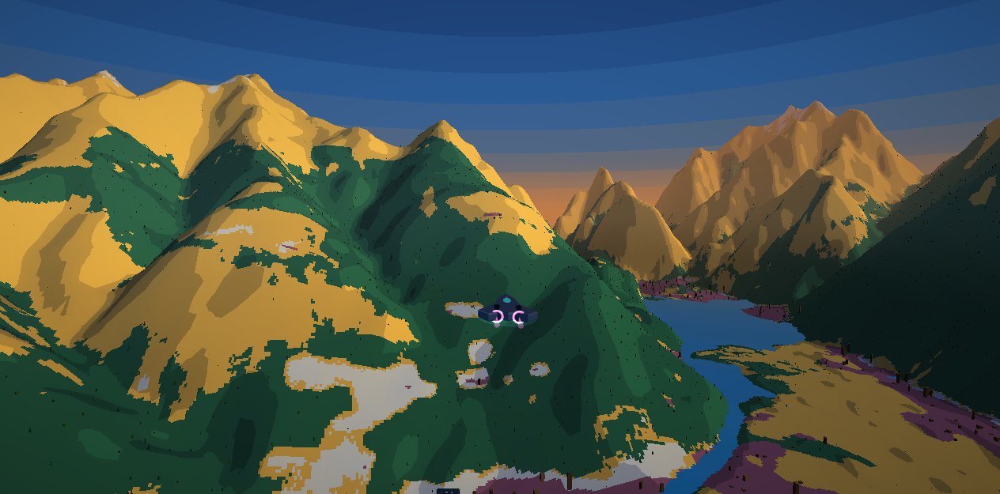

# Driftworld

An alien craft on the real Earth. You can only travel where the satellite says
there is water.

Everything you fly over is real data: land cover comes from ESRI / Impact
Observatory's Sentinel-2 10 m classification, elevation from 30 m DEM tiles, and
the place names from OpenStreetMap. Water is navigable because the classifier
says it is water — the boat physics read the same pixels you are looking at.

**[30-second flythrough of Lake Como](capture/driftworld.mp4)** (MP4, 1280x720)

<table>
<tr>
<td></td>
<td></td>
</tr>
</table>

## Running it

    python serve.py          # then open http://127.0.0.1:8137/

No build step, no npm. Three.js r160 is vendored in `vendor/`.

Query parameters:

| | |
|---|---|
| `?lat=46.14&lon=9.30` | launch anywhere on Earth |
| `?auto=1` | launch at a preset without clicking |
| `?cinema=30` | fly a scripted 30 s take and record it |

## Controls

| Key | |
|---|---|
| `W` / `Up` | thrust |
| `S` / `Down` | brake, then reverse |
| `A` / `D` | steer (speed-gated - no turning at a standstill) |
| `Shift` | boost (also multiplies climb rate in flight) |
| `V` | toggle cruise / flight |
| `Space` or `R` | climb (flight, no ceiling) |
| `Ctrl` or `F` | descend |
| `M` | toggle chart |
| `G` | teleport to nearest water if stuck |
| `T` | cycle time of day |

## Data

**Land cover** - ESRI / Impact Observatory Sentinel-2 10 m annual LULC, via the
Living Atlas ImageServer `exportImage` endpoint.

**Elevation** - Mapzen / AWS Terrarium 30 m DEM tiles, decoded as
`h = R*256 + G + B/256 - 32768`.

**Place names** - BigDataCloud reverse geocode for the locality readout, and
OpenStreetMap Overpass for named towns and peaks rendered as world labels. Both
are unauthenticated and CORS-permissive.

## Design notes

**Why the ESRI ImageServer and not Planetary Computer.** PC hosts the same
collection (`io-lulc-annual-v02`) but its tiler needs a SAS token that expires
roughly hourly, plus a STAC search per area to resolve an item id. The ESRI
service is unauthenticated, natively EPSG:3857, globally mosaicked, sends
permissive CORS, and lets you force `RSP_NearestNeighbor`. For a browser game
that is strictly simpler. PC is the better choice for batch/analysis work.

**Water collision is an exact RGB test.** With nearest-neighbour resampling the
ImageServer returns unblended palette colours - a sampled fjord tile contained
exactly 6 distinct RGB values, all exact matches to the official IO palette. So
`rgb == #1A5BAB` is an exact classification, not a fuzzy threshold. The boat
probes a point ahead of the bow and slides along the shoreline when blocked.

**The pixel aesthetic is the data.** Categorical 10 m land cover is already flat
indexed colour with hard edges. Textures use `NearestFilter`, lighting is
quantised into 4 steps, water animation is quantised into bands, and the sky is
a banded gradient rather than an atmospheric model. The whole scene renders to a
1/4-resolution buffer and upscales with nearest neighbour.

**Handling is car-like, not throttle-slider.** The boat never moves without a
held key: releasing W coasts to a stop on gentle drag. Steering authority scales
from zero at a standstill up to full at 26 m/s, the turning circle widens with
speed, and steering input is ramped rather than instant. Reverse steers
inverted, like backing up a car.

**Shore contact slides instead of stopping.** The hull tests four points - centre,
bow, and both shoulders. When blocked, it samples the water mask in eight
directions to estimate a shore normal, projects the movement onto the tangent
and retries, scrubbing only 1.5% of speed. Grazing a shoreline no longer kills
your momentum.

**Navigation.** A north-up chart assembles per-tile thumbnails, downsampled
block-max on water so narrow channels survive the reduction - a river you can
drive matters more than the dominant class. Waypoint buoys carry vertical light
columns for long-range visibility, with a heading tape and an off-screen edge
arrow for direction.

**The ship renders in a second, full-resolution pass.** The world is drawn to a
quarter-res target and upscaled with nearest neighbour; the ship then draws into
a cleared depth buffer at full device resolution with antialiasing on. It reads
crisp against deliberately chunky terrain. The tradeoff is that the ship is
never occluded by terrain - acceptable in a chase camera that already clamps
itself above the ground.

**Orientation is carried three ways.** Players lose the front of a symmetric
craft instantly, so: an asymmetric delta silhouette with the nose well forward,
cyan running lights forward against magenta engine bloom aft, and a
forward-pointing chevron on the hover pad projected below the hull.

**Orientation, and three bugs that broke it.** The ship uses `YXZ` Euler order:
with the default `XYZ`, pitch is applied about world X, so heading east turned
pitch into roll. Nothing on the craft spins any more either - a rotating spine
reads as the whole ship turning at quarter resolution, and the hover chevron
that exists to show forward was itself rotating.

**Scenery is instanced per tile, keyed on class.** Conifers and broadleaves on
Trees, boxes with a cubic height distribution on Built (mostly low-rise, a few
towers), shrubs on Rangeland/Crops, rocks on Bare/Snow. A deterministic
per-tile RNG means a rebuild never reshuffles them. Heights sample the *mesh*
grid, not the raw DEM - the mesh is 48 segments across 256 DEM pixels, so
sampling the DEM directly leaves trees floating or buried. Density lives in
`PROPS` in `config.js`; lower the chances there if your GPU struggles.

**Place labels come from two independent sources.** The locality readout
(BigDataCloud) and the world labels (Overpass) fail separately, so a slow or
rate-limited Overpass never blanks the HUD. Overpass is a shared community
service, so queries are debounced by both distance travelled and a hard 20 s
floor, and every failure is silent. Labels draw with `depthTest: false` - seeing
that a town sits behind the ridge ahead is the entire point - with only the
nearest dozen shown, ranked so a city outranks a nearer hamlet.

**Crack-free tile edges.** Every DEM lookup goes through global mercator pixel
coordinates rather than per-tile UVs, so neighbouring meshes compute identical
heights on shared edges. Tiles built before their neighbours arrived are marked
dirty and rebuilt.

## Layout

    src/config.js   palette, tuning constants, locations
    src/geo.js      Web Mercator <-> world-space maths
    src/tiles.js    streaming, PNG decode, water mask, global samplers
    src/terrain.js  DEM-displaced meshes + land-cover shader
    src/player.js   boat physics with water constraint, free-fly mode
    src/nav.js      waypoint buoys, beacons, reach detection
    src/minimap.js  north-up chart from tile thumbnails
    src/sky.js      banded gradient dome
    src/ship.js     alien craft, full-res second pass
    src/props.js    instanced trees, buildings, rocks by class
    src/places.js   reverse geocode + OSM place labels
    src/objectives.js  survey run: energy, scoring, chains, ranks
    src/pixel.js    low-res render target + nearest upscale
    src/main.js     loop, camera, HUD

## Known limits

- Zoom is fixed at 13 (~9 m/px at 60 deg N). There is no LOD pyramid, so the
  visible radius is a fixed 7x7 tiles.
- The DEM is 30 m, so narrow rivers and canals are poorly resolved vertically
  even where LULC marks them navigable.
- Lakes sit at their true elevation because the boat rides the sampled DEM
  height; this works, but a lake with a noisy DEM surface will feel choppy.
- LULC water is a 2021-2023 annual composite; it will not match today's tides.
- Custom coordinates accept latitudes within +/-85 deg, the Web Mercator limit.
